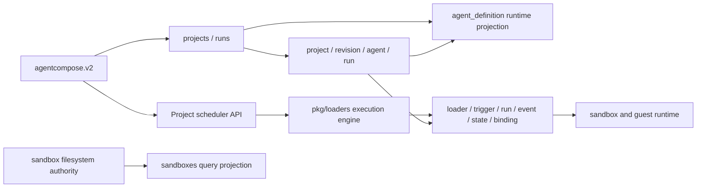

# 存储、Proto 现状与 v1 退役设计

> 本文以提交 `bfbf939` 为核对基线，描述当前实现，而不是历史设想。
> 它同时给出一个最终不再保留业务 v1、loader/session 兼容模型的演进方案。
> 本文只规划后续改造；本次文档变更不修改数据库、Proto 或运行时行为。

## 1. 结论

当前代码不能概括为“v1 和 v2 两套等价模型并存”：

- 业务 v1 Connect Proto 已从仓库和 daemon 路由中删除。当前公开业务协议只有
  `agentcompose.v2`；`health.v1` 是独立健康检查版本，不是业务 v1 的残留。
- `project*` 是声明式项目、agent 运行的 v2 模型，但 scheduler 的实际执行仍由
  `pkg/loaders`、`agent_definition` 和 `loader*` 表承载。它们不是无消费者的旧代码。
- `loader_run` 记录一次 scheduler JavaScript 执行，`project_run` 记录一次 agent 执行；
  一个 scheduler run 可以调用多个 agent run。两者不能直接合表。
- `loader_event` 记录 scheduler 执行和 host 调用，`project_run_event` 记录 agent run 的
  对话、活动和状态序列。它们同样不是重复表。
- Proto 中的 `reserved` 是 wire compatibility 契约。删除或复用这些编号和名字会让旧消息
  被新代码误解，不能把它们当作待清理的 v1 包袱。

因此，彻底退役 v1 的可行路线不是直接删除 `loader*`，而是先让 project/scheduler 领域接管
它们仍然拥有的能力和数据，再通过 expand-copy-cutover-contract 迁移。最终可以清除旧模型，
同时无损保留现有项目、scheduler、历史运行、事件、状态和 sandbox 关系。

## 2. 当前实现

### 2.1 物理存储与迁移

所有关系数据位于 `DATA_ROOT/data.db`：

- `pkg/storage/sqlite/database.go` 使用 `modernc.org/sqlite`，启用 foreign keys、WAL 和
  busy timeout，并把连接池限制为一个 open/idle connection。
- `configstore.ConfigStore` 组合 core、loader、event、project、LLM、capability gateway、
  volume 七个子 store；`sessionstore.Store` 管理 sandbox 文件和查询投影。两个门面共享同一个
  `*sql.DB`。
- baseline 创建 28 张业务/投影表；迁移框架另外创建 `schema_migrations`，所以完成迁移后的
  新库共有 29 张受管表。
- 迁移文件是不可变前缀：已应用文件的版本、名字和 SHA-256 checksum 必须与二进制内嵌文件
  一致。发布后只能追加迁移。

当前迁移为：

| 版本 | 内容 |
| --- | --- |
| `000001_baseline` | 创建 28 张 baseline 表 |
| `000002_sandbox_project_projection` | 重建 sandbox 投影并加入 project ownership |
| `000003_loader_event_sandbox_run` | 为 scheduler run 到 sandbox 的查询增加条件索引 |
| `000004_loader_binding_config_hash` | 为 sticky binding 增加 sandbox 配置 hash |

时间字段并不统一为 Unix 秒：loader trigger/run/event 的活跃写路径使用 Unix 毫秒，
`project_run.started_at/completed_at` 和 `project_run_event.created_at` 也使用毫秒；部分
created/updated 字段仍使用秒。迁移与 scanner 还要接受历史秒值。任何后续 schema 设计都必须
逐字段声明单位，不能依赖“INTEGER 时间”的隐含约定。

单连接降低了 daemon 内部并发写锁的复杂度，但不能“彻底规避 SQLite 锁竞争”：多个 daemon
进程仍可能打开同一文件，慢查询也会阻塞本进程的其他 DB 操作。系统难以水平扩展还来自本地
SQLite、sandbox 文件权威和本机 runtime 生命周期，不能只归因于连接池大小。

### 2.2 数据所有权



当前表可以按所有权分为：

| 领域 | 表 | 当前角色 |
| --- | --- | --- |
| 设置 | `global_env`, `workspace_config`, `capability_gateway` | v2 Settings 仍直接使用，不是纯 v1 数据 |
| Agent runtime | `agent_definition` | project agent 的可执行投影，也承载从业务 v1 留下的 standalone agent |
| LLM | `llm_provider`, `llm_model`, `llm_provider_model`, `llm_facade_token` | daemon LLM 配置与短期凭据 |
| Volume | `volumes`, `project_volumes` | volume 定义与 project binding |
| Scheduler runtime | `loader`, `loader_trigger`, `loader_run`, `loader_event`, `loader_state`, `loader_binding` | 当前 scheduler 执行权威，不只是历史兼容 |
| Project | `project`, `project_revision`, `project_agent`, `project_scheduler`, `project_run`, `project_run_event` | 声明式配置、当前投影与 agent run |
| Event | `event`, `webhook_source`, `event_delivery`, `event_sandbox_link` | 持久事件队列及 scheduler 投递/关联 |
| Sandbox projection | `sandboxes`, `sandbox_projection_meta` | 文件系统 metadata 的可重建查询索引 |

`sandboxes` 不是 sandbox 权威。sandbox metadata、workspace 和 runtime state 位于 sandbox root；
DB 投影用于搜索和分页，并可从文件系统重建。因此 `project_run.sandbox_id`、
`loader_binding.sandbox_id` 等是有意的软引用，不应为了表面上的 FK 完整性把权威关系倒置。

### 2.3 Project 与 scheduler 的真实关系

`ApplyProject` 保存不可变的 `project_revision.spec_json`，并更新 `project_agent` 和
`project_scheduler` 当前投影。但 reconcile 还会：

1. 为每个 project agent 创建或更新一条 managed `agent_definition`；
2. 为每个 project scheduler 创建或更新一条 managed `loader`；
3. 把声明式 trigger 写入 `loader_trigger`；
4. 通过 `managed_agent_id`、`managed_loader_id` 和多个 `managed_*` 字段连接两套记录。

daemon 启动时还会执行 `SyncLegacyDefaultProject`，把没有 managed project 的 standalone
agent/loader 投影到确定性的 `legacy-v1-default` 项目。源记录不会被删除，且该同步每次启动都会
再次扫描。这是当前升级兼容机制，不是已经完成的数据迁移。

运行时的数据流是：

```text
project scheduler
  -> managed loader + loader_trigger
  -> loader_run (一次 scheduler script 执行)
  -> scheduler.agent(...), 可调用零到多个 agent
  -> project_run (每次 agent 执行一条)
  -> project_run_event (agent 对话/活动/状态)
```

`loader_state` 是 scheduler script KV；`loader_binding` 是 loader/trigger 范围的 sticky sandbox
选择；`loader_event` 还可记录没有 run ID 的 lifecycle event。这三种能力在 `project*` 表中都没有
等价替代。因此“删除 loader 六表并让 project_run 接管”会丢数据并破坏调度。

### 2.4 Proto 边界

`proto/agentcompose/v2/agentcompose.proto` 当前定义 12 个业务 service：Project、Run、Exec、
Image、Cache、Volume、Sandbox、Dashboard、Settings、Capability、LLM、Resource。健康检查位于
独立的 `proto/health/v1`。

业务 v1 生成代码和路由已经删除；测试明确要求请求
`/agentcompose.v1.SessionService/GetSession` 返回 404。仍可看到的 v1 痕迹包括：

- v2 Proto 中冻结的 `session_id`、`managed_loader_id` 等 reserved 名字和编号；
- loader JavaScript 的 deprecated `scheduler.session.*` 及 PascalCase aliases；
- 内部 `SandboxRPCBridge` 使用 `CreateSession`、`GetSession` 等 JSON method 名；
- `/api/runtime/sessions/` LLM facade alias、部分 Jupyter session path；
- `pkg/sessions`、`sessionstore`、变量名和历史 event topic；
- legacy sandbox root、metadata 和数据库 shape 的启动兼容代码。

这些项目的兼容级别不同。Proto reserved 和已经持久化的历史 event 值必须保留；仍可调用的
alias 可以经过弃用窗口删除；内部命名可以在消费者切换后重构。

## 3. 对原分析中不合理结论的修正

| 原结论 | 问题 | 修正 |
| --- | --- | --- |
| schema 只有两个迁移 | 已落后于主干 | 当前有四个迁移，后续文档必须以源码枚举为准 |
| 时间列默认都是 Unix 秒 | loader 和 run 活跃路径已使用毫秒 | 为每个时间字段记录单位，并保留历史秒值兼容 |
| loader 与 project 是同一概念的两代重复表 | 忽略了 scheduler run 与 agent run 的一对多关系 | project 是声明式控制面；loader 目前是 scheduler 执行面 |
| v1 loader 冻结后可直接删除 | `pkg/loaders` 仍在启动、触发、执行、恢复和 prune | 先建立 scheduler-native 替代，再迁移和删除 |
| Proto reserved 是 v1 遗迹 | 遗迹属实，但它也是必须维持的 wire tombstone | 在 v2 永久保留；只有新 major package 才能重新设计编号 |
| project 物理删除会级联清理历史 | 公共 RemoveProject 实际是软删除 | 区分 API 行为和理论上的 FK DELETE 行为 |
| 单连接彻底规避锁竞争 | 只串行化单进程连接池 | 仍需考虑多进程、长事务和慢查询 |
| `*_json` 都是建模缺陷 | revision snapshot、event payload 天然适合 opaque JSON | 只将需要过滤、排序、约束或关联的字段结构化 |
| `*_search` 应直接换 NOCASE/generated column | 未证明其能保持当前过滤和兼容语义 | 先以查询计划、Unicode/大小写语义和写放大数据评估 |
| 应引入 sqlc 解决列漂移 | 工具选择没有基于故障数据和迁移成本 | 先用 schema/query contract tests；工具引入另立决策 |
| 所有明文 secret 都可统一信封加密 | 未定义密钥轮换、启动可用性和备份恢复 | 单独设计 secret storage，不与 v1 退役迁移耦合 |

JSON、去规范化和软引用仍需被清楚记录，但不应与“必须消除的 v1 包袱”混成一个无优先级的
backlog。v1 退役的首要风险是双重权威、兼容写路径和运行时依赖，而不是表面命名。

## 4. 目标状态

### 4.1 所有权原则

最终状态遵循以下规则：

1. `projects` 拥有 project、revision、agent 和 scheduler 声明式配置；执行指定 revision 时从
   不可变 revision 解析配置，不再读取 managed `agent_definition` 或 `loader` 快照。
2. `runs` 拥有 agent run 及其 event；scheduler 领域拥有 scheduler trigger、run、event、state
   和 binding。两种 run 保持独立，并通过稳定 ID 显式关联。
3. `sandboxes`（由现有 `sessions` 重命名）拥有 sandbox 生命周期；文件系统继续是 metadata
   权威，SQLite 继续是可重建查询投影。
4. transport 只使用 v2 domain language。内部不再通过 session-shaped JSON RPC 调用自身。
5. 数据库不再包含 managed projection 或 v1 bridge column；兼容只存在于不可变历史值和迁移
   记录中，不参与新的业务读写。

### 4.2 目标表与映射

目标模型不合并 scheduler run 与 agent run，而是把 loader 命名和 project bridge 消除：

| 当前来源 | 目标 | 迁移要求 |
| --- | --- | --- |
| standalone `agent_definition` | `legacy-v1-default` 的 revision/`project_agent` | 保留原 agent resource ID；名称冲突沿用现有确定性规则 |
| managed `agent_definition` | 删除 | 验证其配置可由对应 project revision 完整重建 |
| `loader` | `project_scheduler` + revision spec | 保留原 loader ID 作为 scheduler 全局 resource ID；迁移 enabled/last_error |
| `loader_trigger` | `project_scheduler_trigger` | 保留 trigger ID、enabled、next/last fire time 和原始 spec |
| `loader_run` | `scheduler_run` | 保留 run ID、status、时间、payload/result、script hash 和 artifact path |
| `loader_event` | `scheduler_event` | 保留 event ID、可空 run relation、level/payload 和 sandbox/cell/thread links |
| `loader_state` | `scheduler_state` | 原样保留 key/value 和更新时间 |
| `loader_binding` | `scheduler_sandbox_binding` | 保留 trigger scope、sandbox ID、config hash 和时间 |
| `event_delivery.loader_id` | scheduler resource ID | 保留 event/trigger/run/status 组合及幂等性 |
| `event_sandbox_link.loader_*` | scheduler/event resource ID | 保留历史 trace |
| `project_run.managed_agent_id` | project agent resource ID | ID 不变，只移除 “managed” 语义 |
| `project_scheduler.managed_loader_id` | 删除 | scheduler 自身的全局 ID 成为执行引用 |

`project_scheduler.id` 和 `project_agent.id` 在迁移前必须被校验为非空、全局唯一；目标 schema 对其
建立 UNIQUE constraint。scheduler 的运行表引用这个全局 ID，同时保留 project-local
`scheduler_id` 作为展示名称。这样 event、run 和 resource resolver 不必携带脆弱的桥接 ID。

`workspace_config`、LLM、volume、event 主表和 sandbox 投影继续存在，因为它们仍被 v2 功能使用；
不能依据表的创建年代把它们一并删除。

### 4.3 Proto 与兼容入口

本轮内部迁移不改变 v2 wire shape：

- 保留所有 reserved number/name；不复用删除字段编号。
- 现有 RPC 名称和分页 shape 在 v2 内保持兼容。命名或分页统一需要新增 RPC 或进入 v3，不能借
  内部 v1 清理制造隐式 breaking change。
- handler 从新 scheduler/project store 组装相同的 `ProjectScheduler`、`SchedulerRun` 和
  `SchedulerEvent` 响应。

可调用的 session aliases 按明确截止窗口移除：

1. 一个发布周期内记录带调用点的 deprecation warning，并提供 `scheduler.sandbox.*` 替代；
2. 启动时扫描已存 project revision 的 inline scheduler script，发现 `scheduler.session` 或旧
   PascalCase method 时报告 project/scheduler/revision，禁止静默替换用户 JavaScript；
3. 下一 breaking release 删除 alias、旧 runtime LLM URL 和内部 Session RPC bridge；仍命中的
   用户脚本返回包含迁移指引的确定性 validation error；
4. 历史 event topic、payload、Proto reserved 和 migration checksum 永不重写。

### 4.4 包与文件系统命名

数据切换完成后再进行机械重命名：

- `pkg/loaders` 的仍有价值的执行引擎迁入 scheduler owner package，`Loader*` domain types 改为
  `Scheduler*`；不在 transport 或 app 层新建业务模型。
- `pkg/sessions` → sandbox owner package，`pkg/storage/sessionstore` → sandbox store；公开 v2
  `Sandbox` 术语贯穿 store、lifecycle、日志和指标。
- `SandboxRPCBridge` 改为直接调用 sandbox application capability，删除内部 JSON encode/decode
  和 `CreateSession` method switch。
- 新 sandbox root 固定为 `<data-root>/sandboxes`。旧 `<data-root>/sessions` 使用带 journal 的
  一次性迁移：预检目标冲突，逐 sandbox 原子 rename，记录完成项，允许中断后继续；全部完成并
  校验 metadata 后才删除 legacy root 自动探测。
- Jupyter、runtime LLM 和 event producer 改用 sandbox path/topic；历史持久化值不改写。

## 5. 无损实施顺序

### Phase 0：冻结契约与盘点

- 列出所有旧表、managed columns、session aliases、旧目录和 event topic 的生产消费者。
- 为现有 schema、历史秒/毫秒值、legacy-default 导入和旧 sandbox root 建 characterization tests。
- 在升级前输出数据盘点：standalone/managed 记录数、孤儿 bridge、重复 resource ID、缺失 revision、
  非终态 run、artifact 路径和 filesystem collision。发现不满足迁移前置条件时只报错，不写数据。

### Phase 1：Expand 与 backfill

- 追加迁移创建 scheduler-native 表和必要 UNIQUE/FK；不编辑已有四个迁移。
- 在后台组件启动前执行 backfill。纯关系复制在单个 `BEGIN IMMEDIATE` 事务完成；需要解析 project
  spec 的转换由显式、可重复执行的 application migrator 完成，并用独立 migration state 记录阶段。
- 先物化 standalone agent/loader 到 `legacy-v1-default`，保留原 ID；再迁移 managed scheduler
  数据、run/event/state/binding 和 event relations。
- 每张表记录 source count、target count、主键集合和关键字段摘要。任何不一致都回滚该阶段。

### Phase 2：双写与影子校验

- project apply、scheduler trigger、run lifecycle、event delivery、state、binding 和 prune 同时写新旧
  schema；写入必须位于同一 DB transaction，禁止 best-effort 双写。
- 对 Get/List/stream/recovery/prune 执行影子读取并比较排序、分页 cursor、状态、关联和统计，不把
  shadow 结果返回客户端。
- 双写期间旧模型仍是回退读源，但新增记录必须在两边拥有相同稳定 ID。

### Phase 3：Cutover

- 新模型成为唯一读写源；停止生成 managed agent/loader，停止启动期
  `SyncLegacyDefaultProject`，停止旧表写入。
- scheduler 恢复、event dispatcher、sticky reuse、artifact prune、resource resolver、dashboard
  和 stream 全部通过新 owner interface 工作。
- 保留旧表只读一个发布周期；启动时持续比较 terminal history 和未完成 run，禁止降级到会继续写
  旧表的旧二进制。

### Phase 4：Contract

- 备份和迁移校验均成功后，用新迁移删除 `agent_definition`、六张 `loader*` 表及 bridge columns/
  indexes，重建含外键的 SQLite 表时保持事务和 checksum 规则。
- 删除 legacy store methods、model types、startup sync、session aliases、旧路径和旧目录探测；完成
  package/domain 重命名。
- 不删除 Proto reserved、`schema_migrations` 历史、历史 event 字符串或已迁移 artifact。

## 6. 失败与回滚

- DB backfill 在事务提交前失败：回滚，不启动 scheduler 或 event dispatcher。
- application/filesystem migration 中断：根据 migration state/journal 从最后已验证步骤继续；每步必须
  幂等，不能靠“表存在”推断完成。
- 双写任一侧失败：整个业务 transaction 失败并返回带 operation context 的错误，不能产生单边记录。
- shadow mismatch：阻止进入 cutover，输出表、主键和字段级差异，但不得记录 secret/payload 全文。
- cutover 后回滚：只允许回滚到能够读取新 schema 的兼容版本；Phase 4 drop 执行后不支持旧二进制。
- filesystem collision、越界路径、未知 metadata schema 或 active sandbox：标记为阻塞项，绝不覆盖
  或自动删除；由 operator 修复后重试。

## 7. 验收标准

数据迁移必须覆盖：

- 空库、纯 v2 库、仅 standalone v1 数据和新旧混合库；
- 名称冲突、孤儿 bridge、重复 ID、历史秒值、空 trigger ID 和无 run 的 loader event；
- running/terminal/skipped scheduler run、事件投递、state、sticky binding 和 artifact prune；
- 迁移重复执行、事务中断、daemon 重启、filesystem journal 恢复和目标目录冲突；
- 迁移前后所有 v2 Get/List/stream 的可观察等价性，包括分页顺序与 next cursor；
- scheduler run 调用多个 agent run 时的一对多关系和 event trace；
- `go test -race` 覆盖 scheduler lifecycle、双写切换和 sandbox migration 的共享状态路径。

最终完成的判据是：

- 生产代码和新数据中不存在 `agent_definition`/`loader*` 读写、managed bridge 或 startup v1 sync；
- 内部不再暴露 Session RPC/URL/topic alias，package、domain、store 使用 sandbox/scheduler 术语；
- v2 Proto wire contract、历史 run/event/state/binding、sandbox metadata 和 artifact 均保持可用；
- 旧库升级失败时停在可诊断、可重试、未部分切换的状态；
- migration checksum、Proto reserved 和不可变历史数据仍被保留。

## 8. 源码核对入口

| 主题 | 路径 |
| --- | --- |
| SQLite 打开与迁移 | `pkg/storage/sqlite/database.go`, `pkg/storage/sqlite/migrations.go` |
| 当前 schema | `pkg/storage/sqlite/migrations/*.sql` |
| 配置 store 组合 | `pkg/storage/configstore/core_store.go` |
| Project reconcile 与 legacy default | `pkg/projects/reconcile.go`, `pkg/projects/legacy_default_project.go` |
| Scheduler 执行与恢复 | `pkg/loaders/` |
| Agent run | `pkg/runs/` |
| Sandbox 权威与投影 | `pkg/sessions/`, `pkg/storage/sessionstore/` |
| v2 transport contract | `proto/agentcompose/v2/agentcompose.proto` |
| daemon composition | `pkg/agentcompose/app/` |

后续实现应以这些 owner 的实际接口和测试为准；路径发生重构时更新本索引，不在文档中维护易失效的
固定行号。
