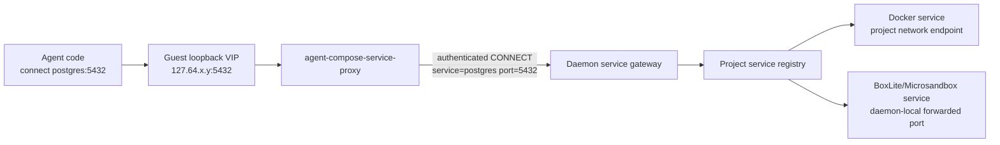

# agent-compose Docker Compose Services 集成设计

状态：提案（尚未实现）  
范围：`agent-compose.yml` 中 Docker Compose Services 的声明、生命周期、driver 与网络  
代码基线：`main@40300587d703b7aba119f0ca08e4919a10cca8d1`

## 1. 目标与核心结论

目标是在 `agent-compose.yml` 中增加一个受控的 `services` 模型，使用户可以用接近
Docker Compose 的方式声明 PostgreSQL、HTTP API、MCP server 等 agent 运行依赖：

```yaml
services:
  postgres:
    image: postgres:18-alpine
    environment:
      POSTGRES_DB: app
      POSTGRES_USER: app
      POSTGRES_PASSWORD: ${POSTGRES_PASSWORD}
    expose:
      - "5432"
    healthcheck:
      test: ["CMD-SHELL", "pg_isready -U app -d app"]
      interval: 5s
      timeout: 3s
      retries: 20

agents:
  worker:
    provider: codex
    driver:
      docker: {}
    depends_on:
      postgres:
        condition: service_healthy
    env:
      PGHOST: postgres
      PGPORT: "5432"
      PGDATABASE: app
      PGUSER: app
      PGPASSWORD:
        value: ${POSTGRES_PASSWORD}
        secret: true
```

推荐结论：

1. `services` 采用 Compose Specification 的**明确子集**，而不是重新发明一套
   container YAML。
2. 使用 `compose-go` 解析 Compose short/long syntax，但转换为 agent-compose 自己的
   normalized model；不能直接把 Docker Compose CLI 当 runtime。
3. service 由 daemon 启动和管理；`agent-compose up` 等价于声明式、后台运行的
   `docker compose up -d --wait`，不会启动 agent run。
4. agent 使用现有 `env` 配置地址。service key 就是 hostname，`expose` 中的端口就是
   agent 使用的端口；不自动猜测 `DATABASE_URL` 或协议。
5. Docker agent 与 Docker service 通过 project Docker network 直连。
6. 涉及 BoxLite/Microsandbox 时，通过 agent-compose project service gateway 打通
   MicroVM 与 service，仍保持 `postgres:5432` 这样的地址体验。
7. service 执行 driver 与 agent driver 解耦。service 默认使用 Docker，也可通过
   `x-agent-compose.driver` 选择 BoxLite/Microsandbox。
8. 对未支持的 Compose 字段必须 fail closed 并说明字段路径；不能静默忽略，因为不少
   字段会改变安全边界、网络身份或跨 driver 可移植性。

## 2. 为什么只支持 Compose 子集

Docker Compose 的 service 模型不仅描述“如何启动一个进程”，还可以控制 host
namespace、设备、内核参数、网络、构建上下文、Swarm deploy、交互终端等。直接全量
开放会产生三个问题：

- **控制权冲突**：project network、container identity、restart、health 和 cleanup
  应由 agent-compose daemon 管理，不能同时由 YAML 的任意 Compose 字段改写。
- **宿主机安全**：agent-compose 部署通常持有 Docker socket 和 `/dev/kvm`；
  `privileged`、device、host mount、host namespace 等字段可直接扩大到 host root。
- **driver 不一致**：Docker、BoxLite、Microsandbox 对 user、tmpfs、init、device、
  network namespace 等能力不同。接受字段却在某些 driver 中忽略，比直接报错更危险。

因此 service 子集遵守以下原则：

- 只支持启动普通、非特权、长期运行或一次性任务所需的字段；
- 同一字段在三种 driver 中必须有可解释的等价语义；
- 影响 host 安全或绕过 project network 的字段默认禁止；
- 非核心字段后续按真实需求逐项加入，不能通过“透传到 Docker”绕过设计。

## 3. YAML 模型

### 3.1 基本结构

```yaml
name: example

services:
  api:
    image: ghcr.io/example/api:1.0.0
    pull_policy: if_not_present
    entrypoint: ["/app/api"]
    command: ["serve"]
    environment:
      LISTEN_ADDR: 0.0.0.0:8080
    working_dir: /app
    expose:
      - "8080"
    healthcheck:
      test: ["CMD", "/app/api", "healthcheck"]
      interval: 5s
      timeout: 2s
      retries: 10
    restart: unless-stopped
    labels:
      app.component: api
    x-agent-compose:
      driver: docker

agents:
  worker:
    provider: codex
    depends_on:
      api:
        condition: service_healthy
    env:
      API_BASE_URL: http://api:8080
```

`x-agent-compose` 是 Compose 允许的 extension，不是 Docker Compose service 指令。
第一阶段只定义：

```yaml
x-agent-compose:
  driver: docker | boxlite | microsandbox
```

driver 解析顺序：

1. `services.<name>.x-agent-compose.driver`；
2. daemon `SERVICE_RUNTIME_DRIVER`；
3. 默认 `docker`。

不能从某个 agent 的 driver 隐式推导 service driver。一个 project 可以有多个 agent，
它们可能使用不同 driver；同一 service 只能有一个 desired runtime instance。

### 3.2 agent 引用 service

agent 继续使用通用 `env`：

```yaml
agents:
  worker:
    env:
      DB_HOST: postgres
      DB_PORT: "5432"
      API_BASE_URL: http://api:8080
```

约定：

- hostname 固定为 service key；
- port 使用 service 内部端口，不使用动态 host forwarding port；
- scheme、path、database、用户名和密码由用户配置；
- service 重建、IP 变化或 runtime driver 变化不改变 agent env；
- service env 和 agent env 相互独立，不能自动复制；
- project/global/agent/run env 的现有优先级保持不变。

新增 `agents.<name>.depends_on` 只负责 readiness：

```yaml
depends_on:
  postgres:
    condition: service_healthy
  migrate:
    condition: service_completed_successfully
```

支持：

- `service_started`：service workload 已运行；
- `service_healthy`：healthcheck 为 healthy；
- `service_completed_successfully`：一次性 workload 退出且 exit code 为 0。

`depends_on` 不生成连接 URL，也不替代 env。`service_healthy` 引用没有 healthcheck 的
service 时必须报配置错误。

## 4. 支持的 Compose service 指令

以下是第一阶段的 portable core。除特别说明外，三种 driver 都必须提供等价语义。

| 指令 | 支持方式 | 为什么支持 / 约束 |
| --- | --- | --- |
| `image` | 必填 | 三种 driver 已具备 Docker/OCI image 解析或物化基础，是统一 workload 输入 |
| `pull_policy` | 支持 `always`、`if_not_present/missing`、`never` | 仓库已有 image pull policy；语义可跨 driver 统一 |
| `entrypoint` | 支持 string/list | Docker 原生支持；BoxLite 可设置 entrypoint；Microsandbox 有 `WithEntrypoint` |
| `command` | 支持 string/list | 与 entrypoint 合并后得到最终 workload；必须保留 shell/exec form 区别 |
| `environment` | 支持 map/list | 最通用的 service 配置方法；在 CLI 侧完成插值后发送给 daemon |
| `env_file` | 受限支持 | CLI 读取并合并为 normalized env；daemon 不依赖 CLI 文件路径 |
| `working_dir` | 支持 | Docker、BoxLite options、Microsandbox `WithWorkdir` 都有对应能力 |
| `expose` | 支持 TCP 端口 | 是 project 内部 service port contract，也是 MicroVM gateway 的端口 allowlist |
| `healthcheck` | 支持 `CMD`/`CMD-SHELL`、interval、timeout、retries、start_period | daemon 可通过 driver exec 或 service endpoint 检查 readiness |
| `depends_on` | 支持 started/healthy/completed_successfully | daemon 可按 DAG 统一排序和等待，不依赖具体 driver |
| `restart` | 支持 `no`、`on-failure`、`always`、`unless-stopped` | Docker 映射 restart policy；MicroVM 由 daemon supervisor 实现相同决策 |
| `stop_grace_period` | 支持 | 映射为 workload 优雅停止窗口；超时后强制停止 runtime |
| `stop_signal` | 受限支持 `SIGTERM`/`SIGKILL` | 三种 driver 可实现共同最小集；其他 signal 暂不承诺 |
| `volumes` | 受限支持 project named volume | 复用现有 agent-compose volume inventory；不允许隐式 host path/匿名 volume |
| `labels` | 支持 | 用于业务元数据；`io.chaitin.agent-compose.*` 保留给系统 identity |
| `extends` | 受限支持 | 仅 CLI 解析阶段从已有 Compose 文件展开；normalized spec 中不保留文件依赖 |

### 4.1 image 与 workload 启动

service 没有显式 `entrypoint`/`command` 时，应读取 OCI image config 中的
`Entrypoint`、`Cmd`、`Env`、`WorkingDir`，再用 YAML override。不能沿用当前 agent
sandbox 的固定空闲命令：

- Docker agent sandbox 当前主要以 `tail -f /dev/null` 或 Jupyter 命令保持运行；
- BoxLite agent sandbox 当前使用 `sh -lc` + `sleep infinity` 或 Jupyter 命令；
- Microsandbox agent sandbox 当前以 agent/Jupyter 所需 options 创建。

这些路径证明三种 runtime 能启动 image，但尚未形成通用 service workload 语义。
实现时应增加 `RuntimeRoleService` 或单独的 `ServiceRuntime`，不要继续给 agent sandbox 启动路径叠加条件分支。

### 4.2 environment 与 secret

service `environment` 遵循 Compose 写法；`${NAME}` 从 CLI normalization environment 读取。`env_file` 也由 CLI 解析并扁平化，因此远程 daemon 不需要访问该文件。

如果某个插值 key 同时在 project `variables` 中标记为 `secret: true`，normalized service env 应保留 secret 标记，用于 `config`、API 和日志脱敏。SQLite 当前不是加密 secret store，部署仍需保护 `DATA_ROOT`。

### 4.3 expose

`expose` 在本设计中不是可有可无的文档字段，而是 service 内部端口契约：

- Docker direct network 中，agent 使用 `service-name:exposed-port`；
- MicroVM/cross-driver gateway 只允许连接已声明端口；
- daemon 用它建立 backend port forwarding 与 guest local listener；
- healthcheck 使用网络模式时只能访问声明端口；
- 未声明的动态端口不保证可达。

第一阶段只支持 TCP。UDP、SCTP 后续需要独立的数据面设计。

### 4.4 volumes

复用当前顶层 `volumes` 与 agent volume mount：

```yaml
services:
  postgres:
    image: postgres:18-alpine
    volumes:
      - postgres-data:/var/lib/postgresql/data

volumes:
  postgres-data: {}
```

第一阶段只允许 source 为当前 project 已声明的 named volume：

- Docker service 使用 bind/driver adapter 挂载；
- BoxLite/Microsandbox 复用当前 runtime mount manifest；
- `down` 不删除 volume；
- service recreate 保留 volume；
- local volume 的 uid/gid/mode 仍需满足 image workload；这是现有 local volume
  backend 的约束，不应通过 privileged service 绕过。

## 5. 不支持或受限的 Compose 指令及原因

### 5.1 第一阶段明确不支持

| 指令 | 不支持原因 |
| --- | --- |
| `build` | CLI 与 daemon 可能不在同一主机；daemon 看不到 build context。后续需要 context upload/remote source，而不是传路径 |
| `container_name` | 破坏 project-scoped identity、并发 project 和 recreate；service key/network alias 已提供稳定名称 |
| `networks`、`network_mode` | project network/gateway 必须由 agent-compose 统一创建，否则 service-name、MicroVM 路由和 cleanup 无法保证 |
| `links`、`external_links` | legacy Docker 机制；project DNS 已替代，并且无法跨 MicroVM driver |
| `hostname`、`domainname` | 容易让进程自身 hostname 与对外 service identity 分裂；首期只保留 service key |
| `ports` | agent 内部访问不需要 host publish；公开 host port扩大攻击面且三种 driver 行为不同。首期由系统动态转发给 gateway，不作为用户 API |
| `privileged` | 等价于显著扩大 host/kernel 攻击面，与 agent-compose 持有 Docker socket/KVM 的部署组合风险过高 |
| `devices`、`device_cgroup_rules`、`gpus` | 直接暴露 host device；三种 driver device model 不一致，需要独立资源授权模型 |
| `cap_add`、`security_opt` | 可扩大 Linux capability/LSM 权限；MicroVM 中也没有相同映射 |
| `pid`、`ipc`、`uts`、`userns_mode` | host/container namespace 共享会破坏隔离，且不能映射到 MicroVM |
| `sysctls`、`cgroup`、`cgroup_parent` | 修改 kernel/cgroup 行为，driver 差异大，应由 daemon policy 管理 |
| `extra_hosts`、`dns`、`dns_search` | 可绕过 project service discovery 和网络策略；MicroVM 使用 agent-compose 管理的 resolver/proxy |
| `use_api_socket`、Docker socket mount | service 可获得 daemon 同级控制权，等价于 host root |
| host bind mount | 路径属于 daemon host而非 CLI host，易越权和不可移植；首期只允许 project named volume |
| anonymous volume、`volumes_from` | 缺少稳定 project identity/引用关系，难以 reconcile、保护和跨 driver |
| `configs`、`secrets` | Docker 与 MicroVM 注入方式不同；首期用 env + project secret 标记，后续再建统一 secret/config model |
| `deploy`、`scale`、`replicas` | agent-compose 当前管理单 service instance，不是 Swarm orchestrator；需要独立 replica/rolling-update 设计 |
| `profiles` | 当前 CLI 没有 profile selection，隐式跳过 service 会让 agent dependency 不确定 |
| `tty`、`stdin_open` | service 由 daemon 后台托管，没有长期交互 stdin；调试应通过 `service exec` |
| `logging` | 自定义 Docker logging driver 无法覆盖 BoxLite/Microsandbox；daemon 需要统一 logs API |
| `runtime`、`isolation` | Docker-specific container runtime 选择与 agent-compose driver 抽象冲突 |
| `mac_address`、静态 IP/IPAM | 与 dynamic project gateway、service recreate 和 MicroVM backend 不兼容 |

### 5.2 暂不进入 portable core

以下字段不是一定危险，但当前三 driver 无统一语义，因此先报 unsupported：

| 指令 | 暂缓原因 |
| --- | --- |
| `user`、`group_add` | Docker/Microsandbox 有直接能力，当前 BoxLite adapter 未提供等价 user 配置 |
| `read_only` | Docker rootfs flag、BoxLite rootfs、Microsandbox image/mount 的只读边界不同 |
| `tmpfs`、`shm_size` | 三 driver mount API 与配额语义不同 |
| `init` | Docker 可注入 init，MicroVM 自身已有 guest init，不能直接等价 |
| `ulimits`、`oom_*`、`pids_limit` | container cgroup 与 MicroVM resource limit 维度不同 |
| `cpus`、`mem_limit` | 值得支持，但应进入 agent-compose 统一 resource spec，而不是只透传 Docker 字段 |
| `platform` | image store已有 platform 能力，但三 driver materialization 和 host arch 校验需先统一 |

这些字段后续可以转为“driver capability validation”：只有所有目标路径明确支持时才
加入 schema；不能让 compose-go 接受后在 runtime 静默丢弃。

### 5.3 `ports` 的后续策略

如果需要从 agent-compose host 访问 service，可后续开放受限 `ports`：

- 默认只允许 `127.0.0.1:<published>:<target>/tcp`；
- 公网 bind 必须由 daemon deployment policy 显式允许；
- target 必须也在 `expose` 中；
- BoxLite/Microsandbox 映射到 runtime port forwarding；
- 自动分配 published port 时在 API/`service ps` 返回实际值；
- agent 仍使用 service name + target port，不能依赖 published port。

## 6. 启动与管理体验

### 6.1 `up`

`agent-compose up`：

1. CLI 解析完整 `agent-compose.yml`；
2. compose-go 标准化 services，agent-compose 做字段白名单和安全校验；
3. daemon 保存 project desired revision；
4. 创建/检查 project volumes；
5. 创建 project network/service gateway；
6. 拉取或物化 service images；
7. 按 service `depends_on` DAG 启动；
8. 等待 required started/healthy/completed 条件；
9. service ready 后才启用 project scheduler；
10. 返回 change 与 service 状态。

它始终是后台运行，因此不需要照搬 `docker compose up -d` 的 `-d`。默认等待 readiness，
相当于 `docker compose up -d --wait`，因为 agent/scheduler 紧接着会依赖这些 service。

重复 `up` 必须幂等：

- spec hash 未变且 runtime 正常：`unchanged`；
- image/env/command/mount/health 等变化：recreate；
- runtime 丢失：重建；
- YAML 删除 service：删除对应 managed runtime；
- 只处理带 project managed labels/metadata 的资源，不接管同名外部资源。

### 6.2 管理命令

为避免与现有 agent sandbox `ps/logs/exec` 参数冲突，增加 service namespace：

```bash
agent-compose service ps
agent-compose service inspect postgres
agent-compose service logs postgres --follow
agent-compose service exec postgres -- psql -U app
agent-compose service restart postgres
agent-compose service stop postgres
agent-compose service start postgres
```

体验对应 Docker Compose，但 daemon/API 是真实执行者：

- `ps` 显示 service、driver、image、state、health、exposed ports、runtime id；
- `logs` 统一 Docker logs 与 MicroVM workload stdout/stderr；
- `exec` 通过对应 driver exec；
- `restart` 遵守 stop grace period；
- 手工 stop 后 project 状态为 degraded，下一次 `up` 恢复 desired state。

### 6.3 `down`

`agent-compose down` 顺序：

1. 禁用 scheduler；
2. 停止 project agent sandbox；
3. 按依赖图逆序停止并删除 service runtime；
4. 关闭 service gateway/guest tunnel；
5. 删除 project Docker network；
6. 保留 project history、service observed history、image cache 和 named volume。

这与 Docker Compose 默认 `down` 不删除 named volume 的体验一致。

## 7. 三种 driver 如何启动 service

service runtime 应抽象成独立接口：

```go
type ServiceRuntime interface {
    EnsureService(ctx context.Context, desired ServiceInstance) (ObservedService, error)
    StopService(ctx context.Context, service ObservedService) error
    RemoveService(ctx context.Context, service ObservedService) error
    ExecService(ctx context.Context, service ObservedService, command ExecSpec) error
    ServiceLogs(ctx context.Context, service ObservedService, options LogOptions) (LogStream, error)
    ResolveEndpoint(ctx context.Context, service ObservedService, port uint16) (Endpoint, error)
}
```

不能直接把 agent `SandboxRuntime` 当 service runtime：agent sandbox 需要 workspace、
provider state、Jupyter 和交互会话；service 需要 workload supervision、restart、health、
port endpoint 和无 workspace 的长期运行。

### 7.1 Docker

- 使用现有 Docker Engine SDK；
- 创建 project bridge network；
- service key 作为 Docker network alias；
- OCI entrypoint/cmd/env/workdir 映射到 `ContainerCreate`；
- named volume 映射到 mount；
- health/status/logs/exec 使用 Docker API；
- agent Docker container 加入同一 network，直接使用 Docker DNS。

这是第一阶段最先落地的 backend。

### 7.2 BoxLite

当前代码已经具备：

- Docker/OCI image rootfs 解析与物化；
- `boxlite_options_set_entrypoint`、`set_cmd`、`set_workdir`、env；
- network enable；
- volume mount；
- host port -> guest port forwarding。

当前缺口是 adapter 把命令固定成 `sleep infinity`/Jupyter，且只为 Jupyter 配端口。
service backend 需要：

- 使用 normalized service entrypoint/cmd，而不是 agent idle command；
- 为所有 `expose` TCP port 分配 daemon-local forwarding port；
- 捕获 workload exit code/stdout/stderr；
- 映射 healthcheck 和 restart；
- service 退出不等同于整个 daemon 失败。

### 7.3 Microsandbox

当前 SDK/adapter 已具备：

- `WithImage`、`WithEntrypoint`、`WithEnv`、`WithWorkdir`；
- `WithNetwork`，当前 agent 使用 `AllowAll`；
- 自定义 DNS nameserver 与 DNS rebind protection；
- `WithPorts`/PortBindings；
- mount、exec、stats 与 lifecycle。

当前 adapter 只把端口映射用于 Jupyter。service backend 同样需要按 `expose` 建立
daemon-local forwarding、使用 workload entrypoint、采集 exit/log/health，并实现统一
restart。

### 7.4 driver 组合

service driver 与 agent driver 可以不同：

| agent driver | service driver | 网络路径 |
| --- | --- | --- |
| Docker | Docker | project Docker network 直连 |
| Docker | BoxLite/Microsandbox | guest service proxy -> daemon gateway -> MicroVM forwarded port |
| BoxLite/Microsandbox | Docker | guest service proxy -> daemon gateway -> Docker service endpoint |
| BoxLite/Microsandbox | BoxLite/Microsandbox | guest service proxy -> daemon gateway -> MicroVM forwarded port |

因此不需要为每种 agent driver 复制一套 PostgreSQL。project 只有一个 service instance，
由 gateway 消除 runtime network 的差异。

## 8. MicroVM 与 agent runtime 网络打通

### 8.1 为什么不能只配置 DNS

BoxLite/Microsandbox 当前都有出站 NAT，但它们不是 Docker bridge endpoint：

- Docker embedded DNS 只服务同一 Docker network；
- MicroVM 没有 Docker service alias；
- 即使 DNS 返回 Docker container IP，MicroVM 到该 bridge subnet 的路由/iptables 也
  不保证；
- service recreate 后真实 IP 会变化；
- 多个 service 可以监听同一个端口，仅用一个 host gateway IP 无法按 hostname 区分
  PostgreSQL 这类原始 TCP 流量。

所以必须同时解决**名字、路由、端口复用和授权**。

### 8.2 推荐：project service gateway + guest local proxy



具体流程：

1. daemon 为每个 project 建立 service registry：
   `(project_id, service_name, exposed_port) -> runtime endpoint`；
2. 创建 agent sandbox 时，为可访问 service 分配稳定的 guest loopback VIP，例如
   `127.64.0.2`；
3. guest bootstrap 写入 hosts 映射：

   ```text
   127.64.0.2 postgres
   127.64.0.3 api
   ```

   这里写的是稳定虚拟地址，不是真实 container/VM IP，因此 service recreate 后无需
   修改 agent env；
4. guest 中启动轻量 `agent-compose-service-proxy`，监听每个 VIP + exposed port；
5. 收到连接后，proxy 向 daemon 发起带 sandbox scoped token 的 HTTP CONNECT/双向流，
   请求目标是 service name + internal port；
6. daemon 校验 token、sandbox project、service 存在和 port 位于 `expose` allowlist；
7. daemon 通过 registry 解析当前 backend endpoint，并双向转发字节流；
8. service 重建只更新 registry endpoint；agent 继续访问相同 name/port。

建议复用 guest 已可达的 daemon runtime base address，增加：

```text
SERVICE_PROXY_TARGET=<guest-reachable daemon address>
SERVICE_PROXY_TOKEN=<sandbox-scoped secret>
```

真实 Docker IP、MicroVM host forwarding port 不进入 agent env。

### 8.3 为什么使用 loopback VIP

- 不需要让 MicroVM 加入 host bridge/CNI；
- 每个 service 有不同 VIP，因此多个 service 可以同时使用 5432/8080 等相同端口；
- TLS/HTTP 应用仍使用原 service hostname；proxy 不解密业务协议；
- 不依赖动态 backend IP；
- agent 代码完全按普通网络 socket 使用，语言/SDK 无关；
- 同一代理也可注入到运行在 MicroVM 中、且依赖其他 service 的 service workload。

这不同于把真实 container IP 写进 `/etc/hosts`。后者会随 recreate 失效，且仍未解决
MicroVM 到 Docker bridge 的路由。

### 8.4 第一阶段网络边界

- gateway 首期只转发 TCP；PostgreSQL、MySQL、Redis、HTTP、SSE、WebSocket、MCP
  streamable HTTP 都可工作；
- UDP service 不支持；
- proxy 按 project 隔离，不能访问其他 project service；
- 只允许 `expose` 声明的端口；
- long-lived connection 在 service recreate 时会断开，由应用重连；
- Docker agent -> Docker service 默认直连，减少延迟；混合 driver service 只为需要的
  hostname 注入 VIP/proxy；
- service 自身存在 `depends_on` 且 backend 是 MicroVM 时，也注入同一 guest proxy；
- gateway 不应监听公网，只通过 daemon 内部/runtime endpoint 暴露。

## 9. daemon reconcile 与数据模型

最小 desired/observed 模型：

```text
NormalizedServiceSpec
  name
  driver
  image / pull_policy
  entrypoint / command
  environment
  working_dir
  exposed_ports
  healthcheck
  depends_on
  restart / stop
  volumes / labels

ProjectServiceRecord
  project_id / service_name / revision
  spec_hash / driver / image
  runtime_id
  status / health / exit_code
  backend_endpoints
  last_error / timestamps
```

Docker container、BoxLite box、Microsandbox sandbox 都带相同逻辑 labels/tags：

```text
managed=true
project_id=<id>
service=<name>
revision=<revision>
spec_hash=<hash>
runtime_role=service
```

新增 owner package建议为 `pkg/projectservices/`，负责 DAG、reconcile、health、restart、
registry 和 gateway；driver adapter 只实现 runtime 操作，不持有 project desired-state
规则。

v2 proto 至少增加：

- `ProjectSpec.services`；
- `AgentSpec.depends_on`；
- typed `ServiceSpec`/health/dependency/exposed port；
- observed `ProjectService`；
- `ProjectSummary.service_count`；
- service list/inspect/log/exec/restart RPC。

## 10. 实施顺序

### Phase 1：model + Docker backend

- compose-go 解析与字段白名单；
- normalized service/hash/proto/store；
- Docker service runtime；
- project Docker network；
- Docker agent 通过 service name 直连；
- `up/down/service ps/logs/exec/restart`；
- PostgreSQL、HTTP/MCP E2E。

### Phase 2：统一 service gateway

- project service registry；
- daemon CONNECT gateway 与 sandbox token；
- guest loopback VIP/hosts/bootstrap proxy；
- BoxLite/Microsandbox agent -> Docker service E2E；
- mixed service driver routing。

### Phase 3：BoxLite/Microsandbox service backend

- service role entrypoint/cmd/env/workdir；
- expose -> daemon-local port forwarding；
- workload log/exit/health/restart；
- local volume mount；
- 四类 agent/service driver 组合 E2E。

## 11. 验收标准

1. `agent-compose config` 对所有 supported/unsupported 字段给出稳定路径化结果；
2. `agent-compose up` 启动 service 并等待 health，不启动 agent；
3. Docker agent 使用 `postgres:5432` 成功连接 Docker PostgreSQL；
4. BoxLite/Microsandbox agent 使用同样的 `postgres:5432` 经 gateway 成功连接；
5. Docker/BoxLite/Microsandbox service 都能从同一 image + entrypoint/cmd 启动；
6. service recreate 后 agent env 不变，新的连接自动解析到新 endpoint；
7. 两个 project 都有名为 `postgres` 的 service 时不串流量；
8. 未在 `expose` 声明的端口被 gateway 拒绝；
9. sandbox token 不能访问其他 project service；
10. `down` 清理 service runtime/network/gateway，但保留 named volume；
11. daemon 重启后能从 DB + runtime metadata 恢复 service observed state并继续 reconcile；
12. privileged、host network、device、Docker socket、host bind 等字段在创建 runtime 前
    被拒绝。

## 12. 方案总结

本方案把 Docker Compose Services 抽象为 agent-compose project 的受管依赖：

- YAML 使用 Compose portable core，并对不安全或不可跨 driver 的字段 fail closed；
- daemon 统一负责 service desired state、启动顺序、健康检查、restart、日志和清理；
- agent 继续通过 env 使用 service name + internal port，不感知 runtime endpoint；
- Docker 同 network 时直接通信，跨 Docker/BoxLite/Microsandbox 时通过 project service
  gateway 保持相同的网络地址；
- 先落地 Docker backend，再补齐 gateway 和 MicroVM service backend，以可验证的阶段
  逐步获得跨 driver 一致体验。

